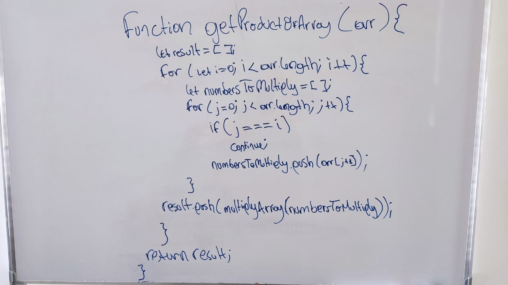

## Section: Arrays
## 1. Get product of all other elements
#### Description:
Given an array of integers, return a new array such that each element at index **_i_** 
of the new array is the product of all the numbers in the original array except the one
at **_i_**

**For example**, if our input was [1, 2, 3, 4, 5] the expected output would be 
[ 120, 60, 40, 30, 24 ] If our input was [3, 2, 1] the expecte output would be 
[2, 3, 6]

##### Draft on whitepaper & link to execute on jsfiddle:
##### (https://jsfiddle.net/zyjb0eh4/2/)

