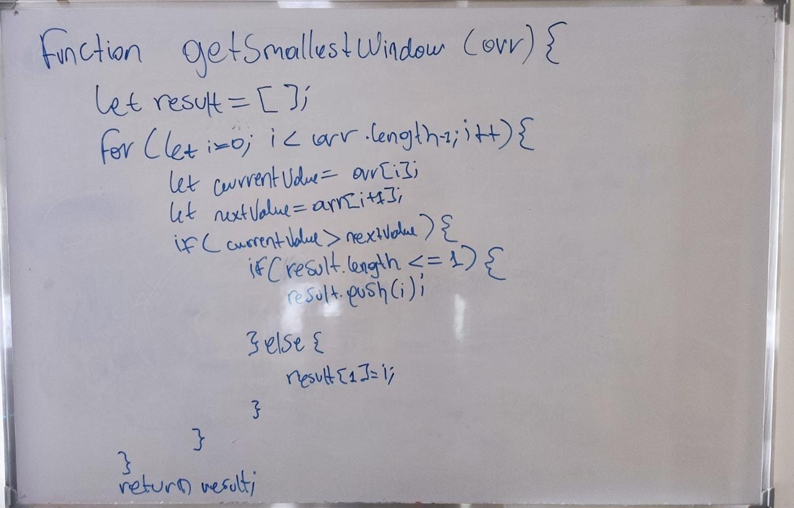

## Section: Arrays
## 2. Locate smallest window to be sorted
#### Description:
Given an array of integers that are out of order, determine the bounds of the
smallest window that must be sorted in order for the entire array to be sorted.

**For example**, given [3, 7, 5, 6, 9], you should return (1, 3).

##### Draft on whitepaper & link to execute on jsfiddle:
##### (https://jsfiddle.net/oz804vbw/1/)

